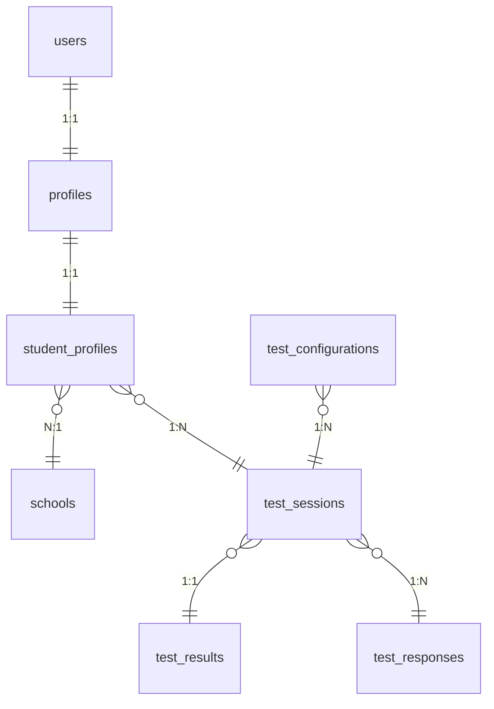
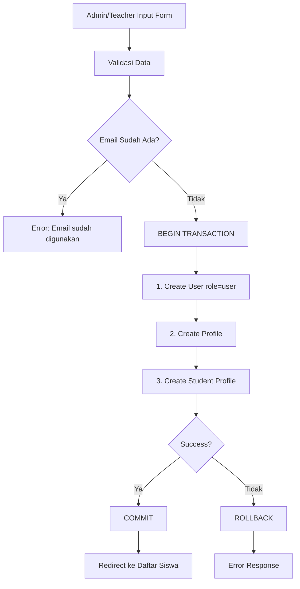
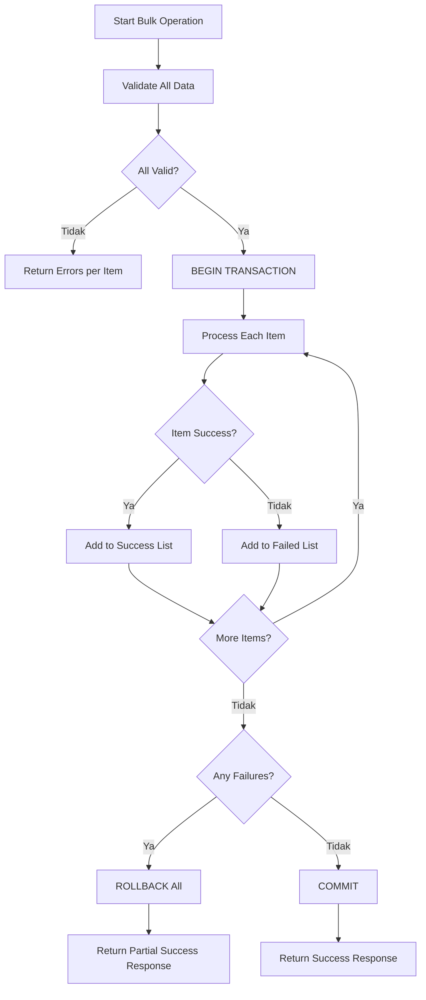

# Analisis Schema Student & Rencana Bulk Input

**Keputusan Implementasi**: 2 Fungsi Terpisah (Opsi 1)

- **Fungsi 1**: Bulk Create Students (user + probadi tanpa nilai)
- **Fungsi 2**: Bulk Input Scores (nilai untuk student existing)

---

## 1. Analisis Schema Student

### 1.1 Struktur Database

Berikut adalah struktur schema untuk student dengan role `user`:



### 1.2 Detail Tabel

#### Tabel `users`

| Field         | Type      | Nullable | Default | Keterangan               |
| ------------- | --------- | -------- | ------- | ------------------------ |
| id            | bigint    | NO       | AUTO    | Primary key              |
| email         | string    | NO       | -       | Unique, untuk login      |
| password      | string    | YES      | -       | Hashed (bcrypt)          |
| name          | string    | YES      | -       | Nama lengkap             |
| avatar        | string    | YES      | -       | URL foto profil          |
| is_active     | boolean   | NO       | true    | Status akun              |
| role          | enum      | NO       | 'user'  | super-admin, admin, user |
| last_login_at | datetime  | YES      | -       | Waktu login terakhir     |
| created_at    | timestamp | NO       | NOW()   | Waktu pembuatan          |
| updated_at    | timestamp | NO       | NOW()   | Waktu update terakhir    |

#### Tabel `profiles`

| Field        | Type      | Nullable | Default | Keterangan                               |
| ------------ | --------- | -------- | ------- | ---------------------------------------- |
| id           | bigint    | NO       | AUTO    | Primary key                              |
| user_id      | bigint    | NO       | -       | FK → users.id (unique)                   |
| phone        | string    | YES      | -       | Nomor telepon                            |
| address      | text      | YES      | -       | Alamat lengkap                           |
| birth_place  | string    | YES      | -       | Tempat lahir                             |
| birth_date   | date      | YES      | -       | Tanggal lahir                            |
| gender       | enum      | YES      | -       | male, female                             |
| avatar       | string    | YES      | -       | URL avatar                               |
| social_media | json      | YES      | -       | {facebook, instagram, twitter, linkedin} |
| created_at   | timestamp | NO       | NOW()   | Waktu pembuatan                          |
| updated_at   | timestamp | NO       | NOW()   | Waktu update terakhir                    |

#### Tabel `student_profiles`

| Field           | Type      | Nullable | Default | Keterangan                |
| --------------- | --------- | -------- | ------- | ------------------------- |
| id              | bigint    | NO       | AUTO    | Primary key               |
| profile_id      | bigint    | NO       | -       | FK → profiles.id (unique) |
| school_id       | bigint    | YES      | -       | FK → schools.id           |
| student_id      | string    | YES      | -       | NIS/NISN                  |
| grade_level     | enum      | YES      | -       | 10, 11, 12                |
| major           | string    | YES      | -       | Jurusan (IPA, IPS, dll)   |
| academic_scores | json      | YES      | -       | Nilai per semester        |
| extracurricular | json      | YES      | -       | Kegiatan ekstrakurikuler  |
| achievements    | json      | YES      | -       | Prestasi                  |
| ai_analysis     | json      | YES      | -       | Hasil analisis AI         |
| ai_prompt       | text      | YES      | -       | Prompt AI yang digunakan  |
| parent_name     | string    | YES      | -       | Nama orang tua/wali       |
| parent_phone    | string    | YES      | -       | Telepon orang tua/wali    |
| parent_email    | string    | YES      | -       | Email orang tua/wali      |
| created_at      | timestamp | NO       | NOW()   | Waktu pembuatan           |
| updated_at      | timestamp | NO       | NOW()   | Waktu update terakhir     |

### 1.3 Format JSON Fields

#### `academic_scores` Format

```json
[
  {
    "semester": "Semester 1 Kelas 10",
    "subjects": [
      {
        "name": "Matematika",
        "final_score": 85,
        "sub_scores": {
          "pengetahuan": 80,
          "keterampilan": 90
        }
      },
      {
        "name": "Bahasa Indonesia",
        "final_score": 90
      }
    ]
  }
]
```

#### `extracurricular` Format

```json
[
  {
    "name": "Bulu Tangkis",
    "role": "Pemain",
    "year": "2022"
  }
]
```

#### `achievements` Format

```json
[
  {
    "title": "Juara 1 Lomba Olahraga",
    "level": "Sekolah",
    "year": "2022",
    "certificate_url": "https://example.com/certificate.jpg"
  }
]
```

### 1.4 Flow Registrasi Student (Existing)



---

## 2. Rencana Fitur Bulk Input

### 2.1 Use Cases

#### Use Case 1: Admin/Teacher Input Banyak Student

- **Aktor**: Admin (Guru BK) atau Teacher
- **Tujuan**: Mendaftarkan banyak siswa sekaligus dari sekolah mereka
- **Input**: Multiple student data dengan informasi lengkap
- **Output**: Multiple student accounts created

#### Use Case 2: Input Nilai Akademik Massal

- **Aktor**: Admin (Guru BK) atau Teacher
- **Tujuan**: Input/update nilai akademik banyak siswa sekaligus
- **Input**: Student ID + semester + subject scores
- **Output**: Updated academic_scores untuk multiple students

### 2.2 Struktur Data untuk Bulk Input

#### Bulk Student Input Format

```json
{
  "school_id": 1,
  "students": [
    {
      "name": "Ahmad Rizky",
      "email": "ahmad@student.com",
      "password": "password123",
      "student_id": "0012345678",
      "grade_level": "11",
      "major": "IPA",
      "phone": "08123456789",
      "address": "Jl. Contoh No. 1",
      "birth_place": "Makassar",
      "birth_date": "2008-05-15",
      "gender": "male",
      "parent_name": "Budi Santoso",
      "parent_phone": "081234567890",
      "parent_email": "budi@example.com",
      "academic_scores": [...],
      "extracurricular": [...],
      "achievements": [...]
    }
  ]
}
```

#### Bulk Academic Scores Input Format (UX-Friendly)

**PENTING**: Admin tidak input `student_profile_id` langsung. Admin pilih siswa berdasarkan nama atau NIS/NISN.

```json
{
  "semester": "Semester 1 Kelas 10",
  "student_identifiers": ["0012345678", "0012345679"], // NIS/NISN atau nama
  "scores": [
    {
      "subject": "Matematika",
      "entries": [
        {
          "identifier": "0012345678",
          "final_score": 85,
          "sub_scores": { "pengetahuan": 80, "keterampilan": 90 }
        },
        { "identifier": "0012345679", "final_score": 90 }
      ]
    }
  ]
}
```

**Alternatif**: System akan auto-lookup `student_profile_id` berdasarkan NIS/NISN atau nama yang diberikan.

### 2.3 Komponen yang Perlu Dibuat (SPESIFIKASI FINAL - UX FRIENDLY)

**PRINSIP**: Admin tidak perlu tahu ID internal (user_id, profile_id, student_profile_id, school_id). Sistem handle otomatis.

#### A. Controller Baru: BulkStudentController

```php
// addon/Controllers/BulkStudentController.php

class BulkStudentController
{
    public function __construct(
        private StudentProfileModel $studentModel,
        private ProfileModel $profileModel,
        private UserModel $userModel,
        private SchoolModel $schoolModel
    ) {}

    /**
     * Tampilan form bulk create students
     * GET /admin/students/bulk-create
     *
     * school_id auto-detect dari session user yang login
     */
    public function create(Request $request, Response $response): View
    {
        // Get school_id from session (untuk admin/teacher)
        // atau tampilkan dropdown sekolah (untuk superadmin)
        $schoolId = $this->getSchoolIdFromSession();
        return $response->renderPage(['schoolId' => $schoolId], [...]);
    }

    /**
     * Proses bulk create students
     * POST /admin/students/bulk-create
     *
     * Input (tanpa ID internal):
     * {
     *   "students": [
     *     {
     *       "name": "Ahmad Rizky",
     *       "email": "ahmad@student.com",
     *       "password": "password123",
     *       "student_id": "0012345678",  // NIS/NISN
     *       "grade_level": "10",
     *       "major": "IPA",
     *       "phone": "08123456789",
     *       "parent_name": "Budi Santoso",
     *       "parent_phone": "081234567890"
     *       // ... field lainnya (optional)
     *     }
     *   ]
     * }
     *
     * school_id auto-detect dari session
     */
    public function store(Request $request, Response $response): JsonResponse
    {
        // 1. Get school_id from session (NOT from input)
        // 2. Validate all students data
        // 3. BEGIN TRANSACTION
        // 4. For each student:
        //    - Create User (role='user')
        //    - Create Profile
        //    - Create StudentProfile (dengan school_id dari session)
        // 5. COMMIT on success, ROLLBACK on failure
        // 6. Return: {success: count, failed: count, errors: [...]}
    }

    /**
     * Tampilan form bulk input scores
     * GET /admin/students/bulk-scores
     *
     * Tampilkan list siswa (by name, not ID) dari sekolah admin
     */
    public function scoresForm(Request $request, Response $response): View
    {
        // Get students by school_id from session
        // Return view dengan list siswa (nama, NIS, kelas)
    }

    /**
     * Proses bulk input scores
     * POST /admin/students/bulk-scores
     *
     * Input (admin tidak input student_profile_id):
     * {
     *   "semester": "Semester 1 Kelas 10",
     *   "scores": [
     *     {
     *       "identifier": "0012345678",  // NIS/NISN atau nama siswa
     *       "subject": "Matematika",
     *       "final_score": 85,
     *       "sub_scores": {"pengetahuan": 80, "keterampilan": 90}
     *     }
     *   ]
     * }
     *
     * System akan auto-lookup student_profile_id dari identifier
     */
    public function scoresStore(Request $request, Response $response): JsonResponse
    {
        // 1. Validate semester name
        // 2. For each score entry:
        //    - Lookup student by identifier (NIS/NISN or name)
        //    - Validate score (0-100)
        // 3. BEGIN TRANSACTION
        // 4. For each student:
        //    - Get existing academic_scores JSON
        //    - Merge new semester scores
        //    - Update student_profiles
        // 5. COMMIT on success
        // 6. Return: {success: count, failed: count, errors: [...]}
    }

    /**
     * Helper: Get school_id from session
     * Untuk admin/teacher: dari $_SESSION['admin.school_id']
     * Untuk superadmin: dari input/dropdown
     */
    private function getSchoolIdFromSession(): int
    {
        return $_SESSION['admin.school_id'] ?? 0;
    }
}
```

#### B. Model Methods (StudentProfileModel)

```php
// addon/Models/StudentProfileModel.php

/**
 * Bulk create students dengan transaction
 * @param array $studentsData Array of student data (tanpa school_id)
 * @param int $schoolId School ID untuk semua students (dari session)
 * @param UserModel $userModel User model dependency
 * @param ProfileModel $profileModel Profile model dependency
 * @return array {success: int, failed: int, errors: array}
 */
public function bulkCreate(array $studentsData, int $schoolId, UserModel $userModel, ProfileModel $profileModel): array
{
    $results = ['success' => 0, 'failed' => 0, 'errors' => []];
    $db = $this->getDb();
    $db->beginTransaction();

    try {
        foreach ($studentsData as $index => $studentData) {
            // 1. Create User (role='user' auto)
            $userId = $userModel->create([
                'email' => $studentData['email'],
                'password' => $studentData['password'],
                'name' => $studentData['name'],
                'role' => 'user',
                'is_active' => 1,
            ]);

            // 2. Create Profile
            $profileId = $profileModel->create([
                'user_id' => $userId,
                'phone' => $studentData['phone'] ?? null,
                'address' => $studentData['address'] ?? null,
                'birth_place' => $studentData['birth_place'] ?? null,
                'birth_date' => $studentData['birth_date'] ?? null,
                'gender' => $studentData['gender'] ?? null,
            ]);

            // 3. Create StudentProfile (dengan school_id dari session)
            $this->create([
                'profile_id' => $profileId,
                'school_id' => $schoolId,  // Auto from session
                'student_id' => $studentData['student_id'],
                'grade_level' => $studentData['grade_level'],
                'major' => $studentData['major'] ?? null,
                'parent_name' => $studentData['parent_name'],
                'parent_phone' => $studentData['parent_phone'],
                'parent_email' => $studentData['parent_email'] ?? null,
            ]);

            $results['success']++;
        }

        $db->commit();
        return $results;

    } catch (\Exception $e) {
        $db->rollBack();
        $results['failed'] = count($studentsData) - $results['success'];
        $results['errors'][] = [
            'index' => $results['success'],
            'email' => $studentsData[$results['success']]['email'] ?? 'unknown',
            'error' => $e->getMessage()
        ];
        return $results;
    }
}

/**
 * Find student by identifier (NIS/NISN or name)
 * @param string|int $identifier NIS/NISN or student name
 * @param int $schoolId School ID to scope the search
 * @return array|null Student profile data or null
 */
public function findByIdentifier(string|int $identifier, int $schoolId): ?array
{
    $stmt = $this->getDb()->prepare("
        SELECT sp.*, p.*, u.name as user_name, u.email
        FROM {$this->table} sp
        JOIN profiles p ON sp.profile_id = p.id
        JOIN users u ON p.user_id = u.id
        WHERE sp.school_id = :school_id
          AND (sp.student_id = :identifier OR u.name = :identifier)
        LIMIT 1
    ");
    $stmt->execute(['school_id' => $schoolId, 'identifier' => $identifier]);
    $row = $stmt->fetch();
    return $row === false ? null : $row;
}

/**
 * Bulk update academic scores untuk multiple students
 * Admin input by identifier (NIS/NISN), system auto-lookup student_profile_id
 *
 * @param array $scoresData Array of {identifier, subject, final_score, sub_scores}
 * @param string $semester Semester name
 * @param int $schoolId School ID to scope students
 * @return array {success: int, failed: int, errors: array}
 */
public function bulkUpdateAcademicScoresByIdentifier(array $scoresData, string $semester, int $schoolId): array
{
    $results = ['success' => 0, 'failed' => 0, 'errors' => []];
    $db = $this->getDb();
    $db->beginTransaction();

    try {
        // Group scores by identifier
        $groupedByStudent = [];
        foreach ($scoresData as $score) {
            $groupedByStudent[$score['identifier']][] = $score;
        }

        foreach ($groupedByStudent as $identifier => $scores) {
            // Lookup student by identifier
            $student = $this->findByIdentifier($identifier, $schoolId);
            if (!$student) {
                $results['failed']++;
                $results['errors'][] = [
                    'identifier' => $identifier,
                    'error' => 'Siswa tidak ditemukan'
                ];
                continue;
            }

            // Merge new semester scores with existing
            $existingScores = json_decode($student['academic_scores'] ?? '[]', true) ?? [];

            // Check if semester already exists
            $semesterExists = false;
            foreach ($existingScores as &$sem) {
                if ($sem['semester'] === $semester) {
                    // Merge subjects
                    $sem['subjects'] = $this->mergeSubjects(
                        $sem['subjects'] ?? [],
                        $scores
                    );
                    $semesterExists = true;
                    break;
                }
            }

            if (!$semesterExists) {
                $existingScores[] = [
                    'semester' => $semester,
                    'subjects' => $scores
                ];
            }

            $this->updateById($student['id'], [
                'academic_scores' => json_encode($existingScores)
            ]);

            $results['success']++;
        }

        $db->commit();
        return $results;

    } catch (\Exception $e) {
        $db->rollBack();
        $results['failed'] = count($groupedByStudent) - $results['success'];
        $results['errors'][] = ['error' => $e->getMessage()];
        return $results;
    }
}

/**
 * Merge subjects untuk semester yang sama
 */
private function mergeSubjects(array $existing, array $new): array
{
    $merged = [];
    $existingByName = [];

    foreach ($existing as $subject) {
        $existingByName[$subject['name']] = $subject;
    }

    foreach ($new as $subject) {
        if (isset($existingByName[$subject['name']])) {
            // Update existing subject
            $existingByName[$subject['name']]['final_score'] = $subject['final_score'];
            if (isset($subject['sub_scores'])) {
                $existingByName[$subject['name']]['sub_scores'] = $subject['sub_scores'];
            }
        } else {
            // Add new subject
            $merged[] = $subject;
        }
    }

    return array_merge($merged, array_values($existingByName));
}
```

#### C. Routing

```php
// Routes untuk bulk operations (dapat diakses SuperAdmin, Admin, Teacher)
GET  /admin/students/bulk-create    → BulkStudentController@create
POST /admin/students/bulk-create    → BulkStudentController@store
GET  /admin/students/bulk-scores    → BulkStudentController@scoresForm
POST /admin/students/bulk-scores    → BulkStudentController@scoresStore
```

#### D. UX Flow Summary

| Fungsi          | Admin Input                                                  | System Auto-Handle                                    |
| --------------- | ------------------------------------------------------------ | ----------------------------------------------------- |
| **Bulk Create** | name, email, password, NIS/NISN, kelas, jurusan, parent data | school_id (session), user_id, profile_id, role='user' |
| **Bulk Scores** | semester name, student identifier (NIS/nama), subject, score | student_profile_id lookup, JSON merge                 |

---

## 3. Format CSV untuk Bulk Import

### 3.1 CSV Template - Bulk Create Students

**File**: `template-bulk-students.csv`

```csv
name,email,password,student_id,grade_level,major,phone,address,birth_place,birth_date,gender,parent_name,parent_phone,parent_email
Ahmad Rizky,ahmad@student.com,password123,0012345678,10,IPA,08123456789,"Jl. Merdeka No. 1, Makassar",Makassar,2008-05-15,male,Budi Santoso,081234567890,budi@example.com
Siti Aminah,siti@student.com,password123,0012345679,10,IPA,08123456790,"Jl. Merdeka No. 2, Makassar",Makassar,2008-06-20,female,Siti Nurhaliza,081234567891,siti@example.com
Budi Santoso,budi@student.com,password123,0012345680,10,IPS,08123456791,"Jl. Merdeka No. 3, Makassar",Makassar,2008-07-10,male,Santoso,081234567892,santoso@example.com
Citra Dewi,citra@student.com,password123,0012345681,11,IPA,08123456792,"Jl. Merdeka No. 4, Makassar",Makassar,2007-03-25,female,Dewi Lestari,081234567893,dewi@example.com
Eko Prasetyo,eko@student.com,password123,0012345682,11,IPS,08123456793,"Jl. Merdeka No. 5, Makassar",Makassar,2007-04-18,male,Prasetyo,081234567894,prasetyo@example.com
```

**Field Required (wajib diisi):**

- `name` - Nama lengkap siswa
- `email` - Email untuk login (harus unik)
- `password` - Password (minimal 8 karakter)
- `student_id` - NIS/NISN (8-10 digit angka)
- `grade_level` - Kelas (10, 11, atau 12)
- `parent_name` - Nama orang tua/wali
- `parent_phone` - No. telepon orang tua

**Field Optional (boleh kosong):**

- `major` - Jurusan (IPA, IPS, Bahasa, RPL, TKJ, dll)
- `phone` - No. telepon siswa
- `address` - Alamat lengkap
- `birth_place` - Tempat lahir
- `birth_date` - Tanggal lahir (format: YYYY-MM-DD)
- `gender` - Jenis kelamin (male/female)
- `parent_email` - Email orang tua

**Catatan Import:**

- Gunakan tanda kutip dua (`"`) untuk field yang mengandung koma
- Format tanggal: `YYYY-MM-DD` (contoh: `2008-05-15`)
- Gender: `male` untuk laki-laki, `female` untuk perempuan
- Password minimal 8 karakter
- Email harus unik (tidak boleh sama dengan siswa lain)

---

### 3.2 CSV Template - Bulk Input Scores

**File**: `template-bulk-scores.csv`

```csv
identifier,semester,subject,final_score,pengetahuan,keterampilan
0012345678,Semester 1 Kelas 10,Matematika,85,80,90
0012345678,Semester 1 Kelas 10,Bahasa Indonesia,90,88,92
0012345678,Semester 1 Kelas 10,Bahasa Inggris,78,75,81
0012345678,Semester 1 Kelas 10,Fisika,82,80,84
0012345678,Semester 1 Kelas 10,Kimia,80,78,82
0012345678,Semester 1 Kelas 10,Biologi,85,83,87
0012345679,Semester 1 Kelas 10,Matematika,90,88,92
0012345679,Semester 1 Kelas 10,Bahasa Indonesia,88,85,91
0012345679,Semester 1 Kelas 10,Bahasa Inggris,82,80,84
0012345679,Semester 1 Kelas 10,Fisika,85,83,87
0012345679,Semester 1 Kelas 10,Kimia,83,81,85
0012345679,Semester 1 Kelas 10,Biologi,88,86,90
```

**Field Required (wajib diisi):**

- `identifier` - NIS/NISN siswa (atau nama siswa jika NIS tidak tersedia)
- `semester` - Nama semester (contoh: "Semester 1 Kelas 10")
- `subject` - Nama mata pelajaran
- `final_score` - Nilai akhir (0-100)

**Field Optional (boleh kosong):**

- `pengetahuan` - Skor pengetahuan (0-100)
- `keterampilan` - Skor keterampilan (0-100)

**Catatan Import:**

- Satu baris = satu mata pelajaran untuk satu siswa
- Siswa yang sama bisa memiliki banyak baris (satu per mapel)
- `identifier` harus sesuai dengan NIS/NISN yang ada di sistem
- Nilai harus antara 0-100
- Semester harus konsisten untuk semua baris dalam satu import

---

### 3.3 Alternatif: Format Excel (.xlsx)

Untuk memudahkan admin, template Excel juga tersedia dengan format yang sama:

**Sheet 1: Bulk Students**

| name        | email             | password    | student_id | grade_level | major | phone       | address           | birth_place | birth_date | gender | parent_name  | parent_phone | parent_email     |
| ----------- | ----------------- | ----------- | ---------- | ----------- | ----- | ----------- | ----------------- | ----------- | ---------- | ------ | ------------ | ------------ | ---------------- |
| Ahmad Rizky | ahmad@student.com | password123 | 0012345678 | 10          | IPA   | 08123456789 | Jl. Merdeka No. 1 | Makassar    | 2008-05-15 | male   | Budi Santoso | 081234567890 | budi@example.com |

**Sheet 2: Bulk Scores**

| identifier | semester            | subject          | final_score | pengetahuan | keterampilan |
| ---------- | ------------------- | ---------------- | ----------- | ----------- | ------------ |
| 0012345678 | Semester 1 Kelas 10 | Matematika       | 85          | 80          | 90           |
| 0012345678 | Semester 1 Kelas 10 | Bahasa Indonesia | 90          | 88          | 92           |

**Keuntungan Format Excel:**

- Dropdown untuk field tertentu (grade_level, gender, major)
- Data validation untuk nilai (0-100)
- Conditional formatting untuk highlight error
- Multiple sheets dalam satu file

---

### 3.4 Contoh Penggunaan di UI

```
┌─────────────────────────────────────────────────────────────┐
│  📥 Import dari CSV/Excel                                   │
├─────────────────────────────────────────────────────────────┤
│                                                             │
│  [📥 Download Template CSV]  [📥 Download Template Excel]   │
│                                                             │
│  ┌─────────────────────────────────────────────────────┐   │
│  │  Pilih File:                                         │   │
│  │  [____________________________] [Browse]             │   │
│  │                                                      │   │
│  │  Tipe Import:                                        │   │
│  │  ○ Import Siswa Baru                                 │   │
│  │  ● Import Nilai                                      │   │
│  │                                                      │   │
│  │  Semester:                                           │   │
│  │  [Semester 1 Kelas 10 ▼]                             │   │
│  └─────────────────────────────────────────────────────┘   │
│                                                             │
│  [🚀 Import]  [✕ Batal]                                     │
└─────────────────────────────────────────────────────────────┘
```

---

### 3.5 Validasi CSV/Excel

**Validasi saat Upload:**

1. **Format Check**
   - Column headers harus sesuai template
   - Tipe data sesuai (string, number, date)
   - Required fields tidak boleh kosong

2. **Data Check**
   - Email harus unik (untuk bulk create)
   - NIS/NISN harus unik per sekolah
   - Nilai harus 0-100
   - grade_level harus 10, 11, atau 12

3. **Error Reporting**
   ```json
   {
     "success": false,
     "errors": [
       {
         "row": 3,
         "field": "email",
         "value": "ahmad@student.com",
         "error": "Email sudah digunakan"
       },
       {
         "row": 5,
         "field": "final_score",
         "value": "150",
         "error": "Nilai harus antara 0-100"
       }
     ]
   }
   ```

---

## 4. Implementasi Detail

### 3.1 Validasi Data

#### Validasi Student Data

- Email harus unik (check UserModel)
- student_id (NIS/NISN) harus unik per sekolah
- grade_level harus 10, 11, atau 12
- parent_phone harus format valid
- password minimal 8 karakter

#### Validasi Academic Scores

- Semester name tidak boleh kosong
- Subject name tidak boleh kosong
- final_score harus numeric 0-100
- sub_scores (jika ada) harus key-value pairs

### 3.2 Error Handling

```php
/**
 * Error response format untuk bulk operations
 */
[
  'success_count' => 45,
  'failed_count' => 5,
  'errors' => [
    [
      'index' => 3,
      'email' => 'invalid@email.com',
      'error' => 'Email sudah digunakan'
    ],
    [
      'index' => 7,
      'email' => 'test@student.com',
      'error' => 'NIS/NISN sudah terdaftar'
    ]
  ]
]
```

### 3.3 Transaction Flow



---

## 4. UI/UX Considerations

### 4.1 Bulk Input Form Features

1. **Dynamic Row Addition**: Tombol untuk tambah student row
2. **Inline Validation**: Validasi real-time per field
3. **Copy Down Feature**: Copy nilai dari row sebelumnya
4. **Template Download**: Download template CSV/Excel
5. **Paste from Clipboard**: Paste data dari spreadsheet
6. **Progress Indicator**: Show progress saat processing
7. **Error Summary**: Tampilkan error per row setelah submit

### 4.2 Form Layout

```
┌─────────────────────────────────────────────────────────────┐
│  📥 Bulk Input Siswa                                        │
│  Tambah banyak siswa sekaligus ke sekolah Anda              │
├─────────────────────────────────────────────────────────────┤
│  [Download Template CSV] [Paste dari Excel]                 │
├─────────────────────────────────────────────────────────────┤
│  Student 1                                                  │
│  ┌──────────────────────────────────────────────────────┐   │
│  │ Nama: [________________] Email: [________________]   │   │
│  │ NIS/NISN: [__________] Kelas: [10 ▼] Jurusan: [___] │   │
│  │ [Tambah Nilai Akademik] [Tambah Ekstrakurikuler]     │   │
│  └──────────────────────────────────────────────────────┘   │
│  [× Hapus]                                                  │
├─────────────────────────────────────────────────────────────┤
│  Student 2                                                  │
│  ┌──────────────────────────────────────────────────────┐   │
│  │ ...                                                   │   │
│  └──────────────────────────────────────────────────────┘   │
│  [× Hapus]                                                  │
├─────────────────────────────────────────────────────────────┤
│  [+ Tambah Student]                                         │
│                                                             │
│  [💾 Simpan Semua] [✕ Batal]                                │
└─────────────────────────────────────────────────────────────┘
```

---

## 5. Checklist Implementasi

### Phase 1: Persiapan

- [ ] Analisis schema existing (DONE)
- [ ] Buat dokumen rencana ini (DONE)
- [ ] Review model methods yang ada

### Phase 2: Model Layer

- [ ] Tambah method `bulkCreate()` ke StudentProfileModel
- [ ] Tambah method `bulkUpdateAcademicScores()` ke StudentProfileModel
- [ ] Tambah method `validateBulkStudents()` ke StudentProfileModel
- [ ] Tambah validation helper untuk bulk operations

### Phase 3: Controller Layer

- [ ] Buat method `bulkCreateStudents()` di SchoolAdminController
- [ ] Buat method `processBulkCreateStudents()` di SchoolAdminController
- [ ] Buat method `bulkInputScores()` di SchoolAdminController
- [ ] Buat method `processBulkInputScores()` di SchoolAdminController

### Phase 4: View Layer

- [ ] Buat view bulk-create/index.php
- [ ] Buat view bulk-scores/index.php
- [ ] Buat CSS untuk bulk forms
- [ ] Buat JavaScript untuk dynamic form handling

### Phase 5: Routing & Integration

- [ ] Tambah routes untuk bulk operations
- [ ] Test transaction handling
- [ ] Test error handling
- [ ] Test dengan data besar (100+ students)

### Phase 6: Testing & Polish

- [ ] Unit tests untuk model methods
- [ ] Integration tests untuk controllers
- [ ] UI/UX testing
- [ ] Performance optimization

---

## 6. Pertanyaan untuk Klarifikasi

Sebelum implementasi, perlu konfirmasi:

1. **Metode Input**: Apakah perlu support CSV upload atau hanya form manual?
2. **Batch Size**: Berapa maksimal students yang bisa di-input sekaligus? (rekomendasi: 50-100)
3. **Partial Commit**: Jika ada error di beberapa row, apakah:
   - a) Rollback semua dan ulangi dari awal?
   - b) Commit yang sukses saja dan laporkan yang gagal?
4. **Nilai Akademik**: Apakah perlu support sub_scores (pengetahuan, keterampilan) atau hanya final_score?
5. **Test Results**: Apakah teacher perlu input hasil tes manual atau hanya import dari sistem tes otomatis?
