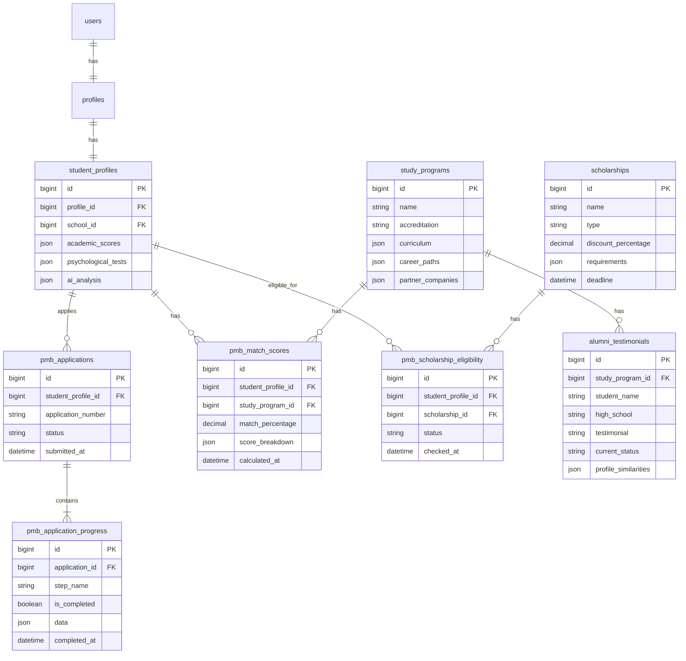
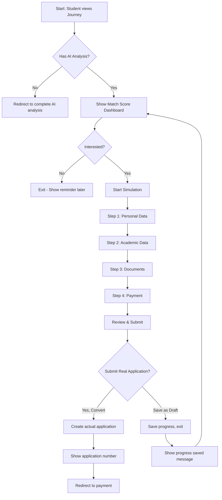

# PMB Journey & Simulation Architecture

## Overview

Fitur **PMB Journey** dirancang untuk meningkatkan conversion rate dari siswa yang telah melakukan analisis potensi, bakat, minat, dan rekomendasi jurusan. Fitur ini memberikan pengalaman yang personal dan engaging untuk memikat siswa mendaftar di Universitas Universal.

## Design Principles

1. **Personalization**: Semua data pre-filled berdasarkan profil siswa
2. **Progressive Disclosure**: Informasi ditampilkan bertahap, tidak overwhelming
3. **Gamification**: Progress tracking, badges, achievement
4. **Social Proof**: Testimonials dari alumni/students dengan profil serupa
5. **Urgency & Scarcity**: Time-limited offers, quota notifications

---

## Information Architecture

```
📱 SIDEBAR NAVIGATION (untuk role: user/siswa)

Dashboard
Profile
  └─ Edit Profile
  └─ Data Akademik
  └─ Prestasi & Eskul
  └─ Hasil Psykotest

🎯 PMB Journey        ← NEW MENU
  ├─ /pmb/journey       → Match Score Dashboard
  ├─ /pmb/simulation    → Simulasi PMB (multi-step wizard)
  └─ /pmb/scholarship   → Scholarship Calculator

Jadwal Konseling     (untuk guru BK)
Siswa Bimbingan      (untuk guru BK)
```

---

## Entity Relationship Diagram



---

## Database Schema

### 1. Tabel `study_programs` (Master Data)

```php
protected array $schema = [
    'id' => ['type' => 'id', 'primary' => true, 'auto_increment' => true],
    'name' => ['type' => 'string', 'nullable' => false],
    'code' => ['type' => 'string', 'nullable' => false, 'unique' => true],
    'accreditation' => ['type' => 'enum', 'values' => ['A', 'B', 'C'], 'nullable' => false],
    'degree_type' => ['type' => 'enum', 'values' => ['S1', 'D3', 'D4'], 'nullable' => false],
    'description' => ['type' => 'text', 'nullable' => true],
    'curriculum' => ['type' => 'json', 'nullable' => true], // {semesters, courses}
    'career_paths' => ['type' => 'json', 'nullable' => true], // [{role, company_type, salary_range}]
    'partner_companies' => ['type' => 'json', 'nullable' => true], // [{name, type, description}]
    'required_skills' => ['type' => 'json', 'nullable' => true], // [{skill, min_score}]
    'is_active' => ['type' => 'boolean', 'nullable' => false, 'default' => true],
];
```

### 2. Tabel `pmb_match_scores`

```php
protected array $schema = [
    'id' => ['type' => 'id', 'primary' => true, 'auto_increment' => true],
    'student_profile_id' => ['type' => 'bigint', 'unsigned' => true, 'foreign' => 'student_profiles.id', 'on_delete' => 'cascade'],
    'study_program_id' => ['type' => 'bigint', 'unsigned' => true, 'foreign' => 'study_programs.id', 'on_delete' => 'cascade'],
    'match_percentage' => ['type' => 'decimal', 'precision' => 5, 'scale' => 2, 'nullable' => false],
    'score_breakdown' => ['type' => 'json', 'nullable' => true], // {logic_score, interest_score, skill_score, etc}
    'calculated_at' => ['type' => 'datetime', 'nullable' => true],
];
```

### 3. Tabel `pmb_applications`

```php
protected array $schema = [
    'id' => ['type' => 'id', 'primary' => true, 'auto_increment' => true],
    'student_profile_id' => ['type' => 'bigint', 'unsigned' => true, 'foreign' => 'student_profiles.id', 'on_delete' => 'cascade'],
    'application_number' => ['type' => 'string', 'nullable' => false, 'unique' => true],
    'study_program_id' => ['type' => 'bigint', 'unsigned' => true, 'foreign' => 'study_programs.id', 'on_delete' => 'set null'],
    'status' => ['type' => 'enum', 'values' => ['draft', 'submitted', 'under_review', 'accepted', 'rejected'], 'nullable' => false, 'default' => 'draft'],
    'submitted_at' => ['type' => 'datetime', 'nullable' => true],
    'reviewed_at' => ['type' => 'datetime', 'nullable' => true],
    'notes' => ['type' => 'text', 'nullable' => true],
];
```

### 4. Tabel `pmb_application_progress`

```php
protected array $schema = [
    'id' => ['type' => 'id', 'primary' => true, 'auto_increment' => true],
    'application_id' => ['type' => 'bigint', 'unsigned' => true, 'foreign' => 'pmb_applications.id', 'on_delete' => 'cascade'],
    'step_name' => ['type' => 'string', 'nullable' => false], // 'personal_data', 'academic_data', 'documents', 'payment'
    'is_completed' => ['type' => 'boolean', 'nullable' => false, 'default' => false],
    'data' => ['type' => 'json', 'nullable' => true], // Stored form data for this step
    'completed_at' => ['type' => 'datetime', 'nullable' => true],
];
```

### 5. Tabel `scholarships`

```php
protected array $schema = [
    'id' => ['type' => 'id', 'primary' => true, 'auto_increment' => true],
    'name' => ['type' => 'string', 'nullable' => false],
    'code' => ['type' => 'string', 'nullable' => false, 'unique' => true],
    'type' => ['type' => 'enum', 'values' => ['akademis', 'prestasi', 'tidak_mampu', 'olahraga', 'seni'], 'nullable' => false],
    'discount_percentage' => ['type' => 'decimal', 'precision' => 5, 'scale' => 2, 'nullable' => false],
    'requirements' => ['type' => 'json', 'nullable' => true], // {min_gpa, min_score, certificates}
    'quota' => ['type' => 'int', 'nullable' => true],
    'deadline' => ['type' => 'datetime', 'nullable' => true],
    'is_active' => ['type' => 'boolean', 'nullable' => false, 'default' => true],
];
```

### 6. Tabel `pmb_scholarship_eligibility`

```php
protected array $schema = [
    'id' => ['type' => 'id', 'primary' => true, 'auto_increment' => true],
    'student_profile_id' => ['type' => 'bigint', 'unsigned' => true, 'foreign' => 'student_profiles.id', 'on_delete' => 'cascade'],
    'scholarship_id' => ['type' => 'bigint', 'unsigned' => true, 'foreign' => 'scholarships.id', 'on_delete' => 'cascade'],
    'status' => ['type' => 'enum', 'values' => ['eligible', 'not_eligible', 'pending_review'], 'nullable' => false],
    'reason' => ['type' => 'text', 'nullable' => true],
    'checked_at' => ['type' => 'datetime', 'nullable' => true],
];
```

### 7. Tabel `alumni_testimonials`

```php
protected array $schema = [
    'id' => ['type' => 'id', 'primary' => true, 'auto_increment' => true],
    'study_program_id' => ['type' => 'bigint', 'unsigned' => true, 'foreign' => 'study_programs.id', 'on_delete' => 'cascade'],
    'student_name' => ['type' => 'string', 'nullable' => false],
    'high_school' => ['type' => 'string', 'nullable' => true],
    'graduation_year' => ['type' => 'int', 'nullable' => true],
    'testimonial' => ['type' => 'text', 'nullable' => true],
    'current_status' => ['type' => 'string', 'nullable' => true], // "Software Engineer @ Gojek"
    'profile_similarities' => ['type' => 'json', 'nullable' => true], // {interests, skills, background}
    'photo_url' => ['type' => 'string', 'nullable' => true],
    'is_featured' => ['type' => 'boolean', 'nullable' => false, 'default' => false],
];
```

---

## File Structure

```
addon/
├── Controllers/
│   └── PmbController.php           # Main controller for PMB features
├── Models/
│   ├── StudyProgramModel.php       # Master data program studi
│   ├── PmbMatchScoreModel.php      # Match score calculation
│   ├── PmbApplicationModel.php     # Application tracking
│   ├── PmbApplicationProgressModel.php  # Step-by-step progress
│   ├── ScholarshipModel.php        # Scholarship master data
│   ├── PmbScholarshipEligibilityModel.php  # Eligibility checking
│   └── AlumniTestimonialModel.php  # Social proof data
├── Views/
│   └── (app)/
│       └── pmb/
│           ├── journey.php         # Match Score Dashboard
│           ├── simulation.php      # Multi-step PMB wizard
│           └── scholarship.php     # Scholarship calculator
└── Router/
    └── index.php                   # Add PMB routes
```

---

## Match Score Algorithm

### Formula

```javascript
matchPercentage =
  (logicScore * 0.25 + // Dari hasil psykotest
    interestScore * 0.3 + // Dari minat yang diinput
    skillScore * 0.25 + // Dari nilai akademik relevan
    potentialScore * 0.2) * // Dari AI analysis
  programWeight;

// ProgramWeight:
// - A accredited: 1.0
// - B accredited: 0.95
// - C accredited: 0.90
```

### Score Breakdown Structure

```json
{
  "logic_score": 85,
  "interest_score": 90,
  "skill_score": 78,
  "potential_score": 88,
  "program_weight": 1.0,
  "final_match": 86.3
}
```

---

## Simulasi PMB Flow



---

## Routes Definition

```php
// PMB routes (require auth, role: user)
$router->group(['middleware' => ['auth', 'role:user']], function () use ($router) {
    // Main PMB pages
    $router->get('/pmb/journey', [PmbController::class, 'journey']);
    $router->get('/pmb/simulation', [PmbController::class, 'simulation']);
    $router->post('/pmb/simulation/step', [PmbController::class, 'saveSimulationStep']);
    $router->get('/pmb/simulation/complete', [PmbController::class, 'completeSimulation']);
    $router->post('/pmb/convert-to-real', [PmbController::class, 'convertToRealApplication']);

    // Scholarship
    $router->get('/pmb/scholarship', [PmbController::class, 'scholarship']);
    $router->post('/pmb/scholarship/calculate', [PmbController::class, 'calculateScholarship']);
    $router->post('/pmb/scholarship/apply', [PmbController::class, 'applyScholarship']);

    // API endpoints (for AJAX)
    $router->get('/api/pmb/match-score', [PmbController::class, 'getMatchScore']);
    $router->get('/api/pmb/progress', [PmbController::class, 'getSimulationProgress']);
    $router->get('/api/pmb/similar-students', [PmbController::class, 'getSimilarStudents']);
});
```

---

## UI Components

### 1. Match Score Dashboard (`/pmb/journey`)

**Sections:**

- Hero section dengan headline personal
- Match Score Card (large visualization)
- Skill Radar Chart
- Career Path Timeline
- Scholarship Eligibility Widget
- Alumni Testimonials Carousel
- CTA: Start Simulation

**Key Visual Elements:**

- Progress circle animation untuk match score
- Bar charts untuk skill comparison
- Timeline visualization untuk career path
- Badge/achievement style untuk scholarships

### 2. Simulation Wizard (`/pmb/simulation`)

**Components:**

- Progress bar (step indicator)
- Form wizard dengan validation
- Pre-filled data dari profile
- Save & Continue Later option
- Document upload dengan drag-drop
- Summary page sebelum submit

**UX Considerations:**

- Auto-save setiap step completed
- Show estimated time remaining
- Provide help tooltips
- Allow going back to previous steps

### 3. Profile Widget (Preview)

**Placement:** Di profile page setelah Quick Actions

**Content:**

- Mini match score badge
- One-liner recommendation
- CTA button ke Journey page

---

## Implementation Phases

### Phase 1: Foundation (Week 1-2)

- [ ] Create all database tables
- [ ] Implement StudyProgramModel
- [ ] Implement PmbMatchScoreModel dengan algorithm
- [ ] Implement ScholarshipModel
- [ ] Basic journey view dengan match score display

### Phase 2: Simulation (Week 2-3)

- [ ] Implement PmbApplicationModel
- [ ] Implement PmbApplicationProgressModel
- [ ] Build multi-step wizard UI
- [ ] Auto-save functionality
- [ ] Document upload system

### Phase 3: Enhancement (Week 3-4)

- [ ] AlumniTestimonialModel
- [ ] Social proof section
- [ ] Scholarship calculator
- [ ] Profile widget preview
- [ ] Analytics tracking

### Phase 4: Conversion (Week 4-5)

- [ ] Convert simulation to real application
- [ ] Payment integration
- [ ] Notification system
- [ ] Admin dashboard for applications

---

## Best Practices

### 1. Data Privacy

- Encrypt sensitive documents
- Secure file upload validation
- GDPR-compliant data handling

### 2. Performance

- Cache match score calculations (valid for 7 days)
- Lazy load alumni testimonials
- Optimize image uploads

### 3. Accessibility

- Keyboard navigation support
- Screen reader friendly
- Color contrast compliance

### 4. Mobile-First

- Responsive design
- Touch-friendly interactions
- Progressive enhancement

---

## Success Metrics

| Metric                         | Target                                    | Measurement      |
| ------------------------------ | ----------------------------------------- | ---------------- |
| Journey Page Views             | 80% of students who completed AI analysis | Analytics        |
| Simulation Start Rate          | 50% of journey page visitors              | Funnel tracking  |
| Simulation Completion          | 70% of started simulations                | Wizard analytics |
| Conversion to Real Application | 30% of completed simulations              | Application data |
| Time on Page                   | > 3 minutes average                       | Analytics        |
| Scholarship Click-through      | 40% of visitors                           | Event tracking   |

---

## Future Enhancements

1. **Chat with Current Students**: Real-time chat feature
2. **Virtual Campus Tour**: 360° video integration
3. **AR Experience**: Campus facilities preview
4. **Gamification**: Badges, leaderboards for simulation progress
5. **AI Chatbot**: Answer FAQs about programs
6. **Parent Portal**: Separate view for parents
7. **Comparison Tool**: Compare multiple programs side-by-side
