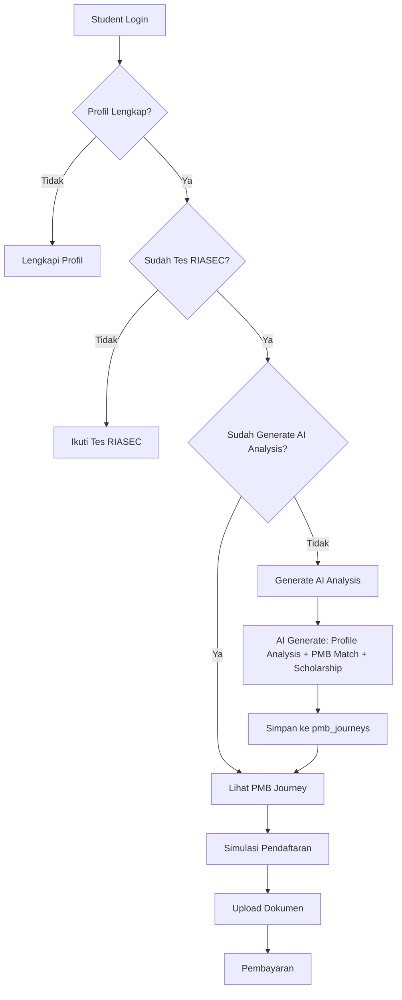
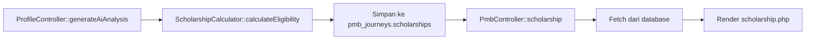
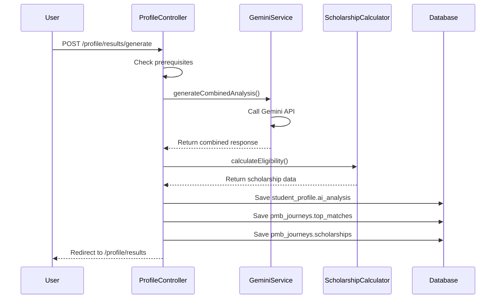

# Implementasi Simulasi PMB - Universitas Almarisah Madani

## 1. Overview

### 1.1 Tujuan

Sistem Simulasi PMB (Penerimaan Mahasiswa Baru) adalah fitur **student-facing** yang memungkinkan calon mahasiswa untuk:

- Mengetahui rekomendasi program studi yang sesuai berdasarkan profil akademik dan hasil tes psikologi
- Menghitung kelayakan beasiswa secara otomatis
- Melakukan simulasi pendaftaran step-by-step sesuai flow PMB sebenarnya
- Melihat estimasi biaya kuliah setelah beasiswa

### 1.2 Scope (Student-Only)

Dokumentasi ini **hanya mencakup fitur untuk siswa**. Fitur admin (verifikasi, approval, dll) tidak dibahas di sini.

---

## 2. Arsitektur Sistem

### 2.1 Data Flow Diagram



### 2.2 Database Schema

#### Tabel `pmb_journeys`

| Column               | Type      | Description                             |
| -------------------- | --------- | --------------------------------------- |
| `id`                 | INT       | Primary key                             |
| `student_profile_id` | INT       | Foreign key ke student_profiles         |
| `top_matches`        | JSON      | Rekomendasi prodi dari AI (match score) |
| `scholarships`       | JSON      | Hasil kalkulasi beasiswa (Rule-Based)   |
| `simulation_step`    | INT       | Progress simulasi (1-3)                 |
| `simulation_data`    | JSON      | Data simulasi yang disimpan per step    |
| `last_data_hash`     | VARCHAR   | Hash untuk deteksi perubahan data       |
| `prompt`             | TEXT      | AI prompt yang digunakan                |
| `created_at`         | TIMESTAMP | Waktu pembuatan record                  |
| `updated_at`         | TIMESTAMP | Waktu update terakhir                   |

---

## 3. Fitur Utama

### 3.1 PMB Journey (`/pmb/journey`)

**Tujuan:** Menampilkan dashboard rekomendasi program studi berdasarkan match score AI.

**Prerequisites:**

1. ✅ Profil siswa lengkap (academic_scores, achievements, extracurricular)
2. ✅ Sudah mengikuti tes RIASEC (data di `test_results`)
3. ✅ Sudah generate AI Analysis (data di `student_profiles.ai_analysis` dan `pmb_journeys`)

**Data yang Ditampilkan:**

- Top 3-5 program studi dengan match score tertinggi
- Holland code dari hasil RIASEC
- Match score breakdown (RIASEC similarity, academic fit, interest alignment)
- Progress simulasi pendaftaran

**Controller:** [`PmbController::journey()`](addon/Controllers/PmbController.php:46-110)

**Flow:**

```php
1. Get student_profile dari logged-in user
2. Check RIASEC test result (minimum requirement)
3. Check AI analysis exists
4. Fetch pmb_journeys dari database
5. Jika tidak ada → redirect ke /profile/results
6. Decode top_matches JSON
7. Inject simulation_progress dari database
8. Render journey.php view
```

**Redirect Conditions:**
| Kondisi | Redirect To | Message |
|---------|-------------|---------|
| Tidak ada student_profile | `/profile/results` | "Profil siswa tidak ditemukan" |
| Belum tes RIASEC | `/profile/results` | "Anda belum mengikuti tes RIASEC..." |
| Belum generate AI analysis | `/profile/results` | "Silakan generate Analisis AI..." |
| Tidak ada top_matches di pmb_journeys | `/profile/results` | "Silakan generate Analisis AI terlebih dahulu..." |

---

### 3.2 Scholarship Calculator (`/pmb/scholarship`)

**Tujuan:** Menampilkan kelayakan beasiswa berdasarkan profil akademik dan prestasi.

**Pendekatan:** **Rule-Based** (bukan AI) menggunakan [`ScholarshipCalculator`](addon/Services/ScholarshipCalculator.php)

**Keuntungan Rule-Based:**

- ⚡ 500x lebih cepat dari AI
- 💰 Zero API cost
- ✅ 100% deterministic (hasil konsisten)
- 🔍 Transparan (aturan jelas)

**Aturan Kelayakan:**

| Beasiswa           | Discount | Syarat                                        |
| ------------------ | -------- | --------------------------------------------- |
| Beasiswa Unggulan  | 100%     | Rata-rata ≥ 90                                |
| Beasiswa Akademis  | 25%      | Rata-rata ≥ 85 && < 90                        |
| Beasiswa Prestasi  | 50%      | Punya prestasi tingkat Nasional/Internasional |
| Beasiswa Teknologi | 25%      | Minat teknologi = "high"                      |

**Stackable:** Beasiswa Prestasi + Teknologi bisa digabung (maksimal 75%)

**Data Flow:**



**Controller:** [`PmbController::scholarship()`](addon/Controllers/PmbController.php:242-276)

**Response Structure:**

```json
{
  "average_score": 80,
  "has_national_achievement": false,
  "technology_interest_level": "medium",
  "eligible_scholarships": [],
  "not_eligible_scholarships": [
    {
      "id": "unggul-001",
      "name": "Beasiswa Unggulan",
      "discount": 100,
      "reason": "Rata-rata nilai minimal 90"
    }
  ]
}
```

---

### 3.3 Simulasi Pendaftaran (`/pmb/simulation`)

**Tujuan:** Wizard simulasi pendaftaran step-by-step sesuai flow PMB sebenarnya.

**3 Steps Simulasi (Sesuai PMB Flow Sebenarnya):**

| Step | Name           | Data yang Dikumpulkan                                        |
| ---- | -------------- | ------------------------------------------------------------ |
| 1    | Data Pribadi   | Nama, email, phone, birth_place, birth_date, gender, address |
| 2    | Upload Dokumen | Ijazah/SKL, Transkrip Nilai, Foto 3x4, Portofolio (optional) |
| 3    | Pembayaran     | registration_fee, discount, total, bank_accounts             |

**Catatan Penting:**

- ❌ **Step "Nilai Akademik" dan "Hasil Analisis AI" DIHAPUS** karena tidak ada dalam flow PMB sebenarnya
- ✅ Step 1 menggunakan data dari profil siswa yang sudah diisi sebelumnya
- ✅ Step 2 menggunakan data dokumen yang sudah di-upload di dashboard
- ✅ Step 3 menampilkan estimasi biaya setelah beasiswa

**Current State:**

- ✅ Step 1: Data Pribadi (pre-filled dari profil siswa)
- ⏳ Step 2: Upload Dokumen (menggunakan data dari dashboard upload)
- ⏳ Step 3: Pembayaran (dummy data, belum integrasi payment gateway)

**Controller:** [`PmbController::simulation()`](addon/Controllers/PmbController.php:115-206)

**Save Progress:**

- Endpoint: `POST /pmb/simulation/step`
- Handler: [`PmbController::saveSimulationStep()`](addon/Controllers/PmbController.php:327-394)
- Status: ✅ Implemented - Save ke database `pmb_journeys.simulation_data`

**Completion:**

- Endpoint: `GET /pmb/simulation/convert`
- Handler: [`PmbController::convertToRealApplication()`](addon/Controllers/PmbController.php:594-632)
- Status: ✅ Implemented - Generate registration number

---

## 4. AI Integration

### 4.1 Combined Prompt Strategy

**Optimization:** Menggabungkan 2 prompts (Student Profile + PMB Match) menjadi 1 API call untuk hemat ~13% cost.

**Before (Separate Calls):**

- Call 1: Student Profile Analysis (~1200 tokens)
- Call 2: PMB Match (~1100 tokens)
- **Total: ~2300 tokens**

**After (Combined):**

- Call 1: Combined Analysis (~2000 tokens)
- **Total: ~2000 tokens** (hemat ~13%)

**Service:** [`GeminiService::generateCombinedAnalysis()`](addon/Services/GeminiService.php:426-461)

**Prompt Structure:**

```
You are an expert educational consultant analyzing a student's profile.

## Student Profile Data
- Academic Scores
- Achievements
- RIASEC Test Results

## Tasks
1. **Student Profile Analysis**
   - Summary
   - Potentials
   - Interests
   - Talents
   - Recommendations
   - Career Suggestions
   - Holland Code
   - RIASEC Scores
   - Data Completeness

2. **PMB Match (Program Studi Recommendation)**
   - Top 3-5 matches with:
     - Program name
     - Match score (0-100)
     - Match reason
     - Holland code alignment
     - Academic fit
     - Career prospects

## Output Format
JSON with student_profile and pmb_match keys
```

---

### 4.2 AI Generation Flow

**User-Initiated Pattern:**
AI analysis **TIDAK** di-generate otomatis. User harus eksplisit klik tombol "Generate Analisis AI" di halaman `/profile/results`.

**Flow:**



**Controller:** [`ProfileController::generateAiAnalysis()`](addon/Controllers/ProfileController.php:421-562)

**Data Hash Mechanism:**

```php
// Hash untuk deteksi perubahan data
$currentHash = md5($academic . $achievements . $riasecData);

// Hanya generate jika data berubah
if ($existingAnalysis && $existingAnalysis['last_data_hash'] === $currentHash) {
    // Skip AI call, gunakan cached data
}
```

---

## 5. Routes

### Student-Facing Routes

| Method | Route                     | Handler                                     | Description                 |
| ------ | ------------------------- | ------------------------------------------- | --------------------------- |
| GET    | `/pmb/journey`            | `PmbController::journey()`                  | Dashboard rekomendasi prodi |
| GET    | `/pmb/simulation`         | `PmbController::simulation()`               | Wizard simulasi pendaftaran |
| POST   | `/pmb/simulation/step`    | `PmbController::saveSimulationStep()`       | Save simulation step data   |
| GET    | `/pmb/simulation/convert` | `PmbController::convertToRealApplication()` | Convert to real application |
| GET    | `/pmb/scholarship`        | `PmbController::scholarship()`              | Kalkulator beasiswa         |

### Related Routes (Profile)

| Method | Route                       | Handler                                   | Description                     |
| ------ | --------------------------- | ----------------------------------------- | ------------------------------- |
| GET    | `/profile/results`          | `ProfileController::results()`            | Halaman hasil tes & AI analysis |
| POST   | `/profile/results/generate` | `ProfileController::generateAiAnalysis()` | Generate AI analysis            |
| GET    | `/profile/academic`         | `ProfileController::academic()`           | Input nilai akademik            |
| GET    | `/profile/achievements`     | `ProfileController::achievements()`       | Input prestasi                  |

---

## 6. Views

### 6.1 Journey View

**File:** [`addon/Views/(app)/pmb/journey.php`](<addon/Views/(app)/pmb/journey.php>)

**Sections:**

- Header dengan progress bar simulasi
- Holland Code badge
- Top Matches cards (match score, reason, career prospects)
- Call-to-action ke simulasi

### 6.2 Scholarship View

**File:** [`addon/Views/(app)/pmb/scholarship.php`](<addon/Views/(app)/pmb/scholarship.php>)

**Sections:**

- Eligible scholarships (discount %, reason, apply link)
- Not eligible scholarships (dengan reason)
- Profile summary stats (average_score, achievements, tech interest)
- Cost estimation (max discount, savings)

### 6.3 Simulation View

**Files:**

- Main: [`addon/Views/(app)/pmb/simulation/index.php`](<addon/Views/(app)/pmb/simulation/index.php>)
- Step 1: [`addon/Views/(app)/pmb/simulation/step1.php`](<addon/Views/(app)/pmb/simulation/step1.php>)
- Script: [`addon/Views/(app)/pmb/simulation/script.js`](<addon/Views/(app)/pmb/simulation/script.js>)
- Style: [`addon/Views/(app)/pmb/simulation/style.css`](<addon/Views/(app)/pmb/simulation/style.css>)

**Sections:**

- Stepper wizard (3 steps)
- Form per step
- Document upload checklist (Step 2)
- Payment info dengan bank accounts (Step 3)
- Success section setelah convert

---

## 7. Best Practices

### 7.1 User-Initiated AI Generation

**✅ DO:**

- User klik tombol "Generate Analisis AI" secara eksplisit
- Check prerequisites sebelum generate
- Cache hasil AI ke database
- Gunakan hash untuk deteksi perubahan data

**❌ DON'T:**

- Auto-generate AI saat user buka halaman
- Call AI API setiap kali halaman di-refresh
- Simpan data AI di JSON field (gunakan tabel terpisah)

### 7.2 Rule-Based vs AI-Based

**Gunakan Rule-Based untuk:**

- ✅ Kalkulasi beasiswa (aturan jelas, deterministic)
- ✅ Validasi form (syarat eksplisit)
- ✅ Score calculation (formula tetap)

**Gunakan AI untuk:**

- ✅ Profile analysis (interpretasi subjektif)
- ✅ Career recommendations (pattern matching kompleks)
- ✅ Match score reasoning (natural language generation)

### 7.3 Data Consistency

**Single Source of Truth:**

- Test results → `test_results` table (bukan JSON di student_profiles)
- AI analysis → `student_profiles.ai_analysis` + `pmb_journeys`
- Scholarships → `pmb_journeys.scholarships` (calculated once, reused)

---

## 8. TODO / Future Enhancements

### 8.1 Simulation Module

- [x] Implement `saveSimulationStep()` ke database
- [x] Implement `convertToRealApplication()` dengan registration number generation
- [ ] Implement document upload functionality (Step 2)
- [ ] Integrate payment gateway (Step 3)

### 8.2 Data Persistence

- [x] Save simulation_data ke `pmb_journeys.simulation_data` JSON
- [x] Track simulation_step progress di database
- [ ] Add user-specific deadline tracking

### 8.3 Validation

- [ ] Validate document file types & sizes (Step 2)
- [ ] Validate payment amount matching (Step 3)
- [ ] Add simulation expiry mechanism

### 8.4 Notifications

- [ ] Email notification saat simulation completed
- [ ] WhatsApp integration untuk payment reminder
- [ ] Dashboard notification untuk pending documents

---

## 9. Related Files

### Controllers

- [`PmbController.php`](addon/Controllers/PmbController.php) - Main PMB simulation controller
- [`ProfileController.php`](addon/Controllers/ProfileController.php) - AI analysis generation

### Models

- [`PmbJourneyModel.php`](addon/Models/PmbJourneyModel.php) - PMB journey data storage
- [`StudentProfileModel.php`](addon/Models/StudentProfileModel.php) - Student profile data
- [`TestResultModel.php`](addon/Models/TestResultModel.php) - RIASEC test results

### Services

- [`GeminiService.php`](addon/Services/GeminiService.php) - AI integration
- [`ScholarshipCalculator.php`](addon/Services/ScholarshipCalculator.php) - Rule-based scholarship calculator

### Views

- [`journey.php`](<addon/Views/(app)/pmb/journey.php>) - PMB journey dashboard
- [`scholarship.php`](<addon/Views/(app)/pmb/scholarship.php>) - Scholarship calculator
- [`simulation/index.php`](<addon/Views/(app)/pmb/simulation/index.php>) - Simulation wizard main
- [`simulation/step1.php`](<addon/Views/(app)/pmb/simulation/step1.php>) - Step 1: Data Pribadi
- [`simulation/script.js`](<addon/Views/(app)/pmb/simulation/script.js>) - JavaScript handlers
- [`simulation/style.css`](<addon/Views/(app)/pmb/simulation/style.css>) - Styling
- [`results.php`](<addon/Views/(app)/profile/results.php>) - AI analysis results

---

## 10. Testing Checklist

### Prerequisites

- [ ] User dapat login
- [ ] User memiliki student_profile
- [ ] User memiliki academic_scores
- [ ] User memiliki achievements (optional)

### RIASEC Test

- [ ] User dapat melihat tombol "Mulai Tes RIASEC"
- [ ] User dapat mengerjakan tes
- [ ] User dapat submit jawaban
- [ ] Hasil tes tersimpan di test_results
- [ ] Holland code terhitung dengan benar

### AI Analysis

- [ ] Tombol "Generate Analisis AI" muncul jika RIASEC sudah ada
- [ ] Generate berhasil menyimpan ai_analysis
- [ ] Generate berhasil menyimpan pmb_journeys.top_matches
- [ ] Generate berhasil menyimpan pmb_journeys.scholarships
- [ ] Hash detection bekerja (skip AI jika data tidak berubah)

### PMB Journey

- [ ] Redirect ke /profile/results jika belum RIASEC
- [ ] Redirect ke /profile/results jika belum generate AI
- [ ] Top matches tampil dengan benar
- [ ] Match score > 0 untuk semua prodi
- [ ] Holland code badge tampil

### Scholarship

- [ ] Redirect ke /profile/results jika belum generate AI
- [ ] Eligible scholarships tampil jika ada
- [ ] Not eligible scholarships tampil dengan reason
- [ ] Profile stats tampil (average_score, achievements, tech interest)
- [ ] Cost estimation menghitung discount dengan benar

### Simulation

- [ ] Stepper wizard tampil (3 steps)
- [ ] Step 1 pre-filled dengan data user
- [ ] Step 2 menampilkan document checklist
- [ ] Step 3 menampilkan payment info
- [ ] Progress bar update sesuai step
- [ ] Save draft berfungsi
- [ ] Convert to real application menghasilkan registration number

---

## 11. Performance Considerations

### API Cost Optimization

- Combined prompt hemat ~13% tokens
- Hash-based caching mencegah duplicate API calls
- Rule-based scholarship = zero AI cost

### Database Queries

- `pmb_journeys` di-fetch sekali per page load
- JSON decode di controller, bukan di view
- Index pada `student_profile_id` untuk fast lookup

### Caching Strategy

- Browser storage untuk jawaban RIASEC (sessionStorage)
- Database cache untuk AI results (pmb_journeys)
- Hash-based invalidation untuk data freshness

---

## 12. Security Notes

### Data Protection

- Student profile hanya accessible oleh owner (user_id match)
- Session-based authentication required
- CSRF protection pada form submit

### Input Validation

- Academic scores: numeric, range 0-100
- Achievements: validated level (sekolah/kabupaten/provinsi/nasional/internasional)
- File uploads: max 2MB, allowed types (PDF, JPG, PNG)

### Rate Limiting

- AI generation: max 1x per menit (prevent abuse)
- Simulation save: debounce 500ms (prevent spam)

---

## 13. Conclusion

Sistem Simulasi PMB ini dirancang dengan prinsip:

1. **Student-Centric:** Semua fitur fokus pada pengalaman siswa
2. **Data-Driven:** Rekomendasi berbasis data RIASEC + akademik
3. **Cost-Effective:** AI hanya digunakan saat diperlukan
4. **Scalable:** Arsitektur loose coupling dengan fallback system
5. **Transparent:** User dapat melihat reason di balik setiap rekomendasi
6. **Aligned with Real PMB:** Flow simulasi sesuai dengan PMB sebenarnya (3 steps)
